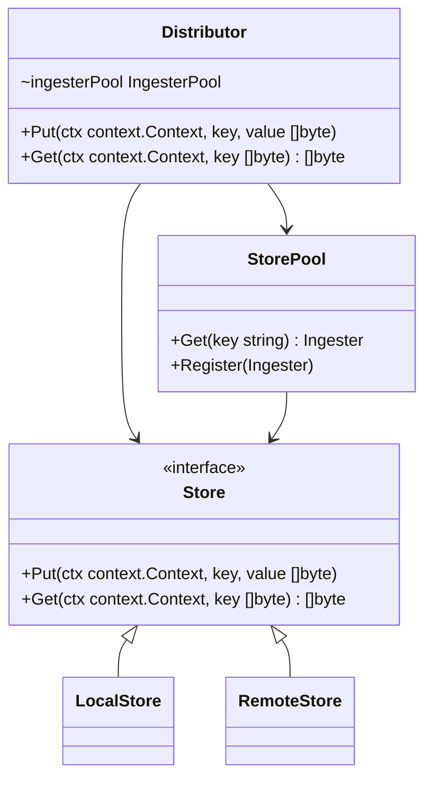

# Dbolt
Distributed BoltDB

Stability: `Toy Project`

# Architecture

```mermaid
classDiagram
    class Distributor {
        ~ingesterPool IngesterPool
        +Put(ctx context.Context, key, value []byte)
        +Get(ctx context.Context, key []byte) []byte
    }
    Distributor --> StorePool
    Distributor --> Store

    class StorePool {
        +Get(key string) Ingester
        +Register(Ingester)
    }
    StorePool --> Store

    class Store {
        <<interface>>
        +Put(ctx context.Context, key, value []byte)
        +Get(ctx context.Context, key []byte) []byte
    }

    class LocalStore
    Store <|-- LocalStore
    class RemoteStore
    Store <|-- RemoteStore
```